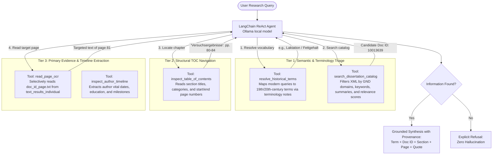

# Dissify Exploration Agent

An autonomous research assistant for historical European dissertations (1850–1950) that bridges antiquated scientific vocabulary, filters literature using domain metadata and relevance scores, navigates document structures via Tables of Contents, and performs targeted page-level OCR reading to produce strictly grounded research syntheses with complete provenance.

---

## 🌟 Hackathon Highlights & Core Concepts

This agent was built for the **AI Agentic Hackathon** and directly demonstrates the foundational concepts of agentic systems:

* **Think $\rightarrow$ Act $\rightarrow$ Observe Loop**: Instead of answering in one shot, the model queries catalog metadata, reasons about which document to inspect, checks chapter boundaries in the Table of Contents, and selectively opens page-level text files.
* **Hierarchical Document Navigation**: Bypasses token and context window limits by navigating from corpus-level metadata down to page-level primary text.
* **Strict Grounding & Provenance**: Every empirical claim cites the **Document ID**, **Section Title**, **Page Number**, and a supporting excerpt from the primary source.
* **Refusal Protocol**: When a requested topic is absent from the Table of Contents or examined pages, the agent explicitly refuses to guess (*"Refusal: Insufficient evidence found in examined records"*).
* **Bounded Autonomy**: Implements hard limits (`max_iterations=12`, `max_page_chars=3000`) to prevent infinite looping and excessive compute usage.
* **100% Offline & Private**: Powered locally via Ollama on a Tesla T4 GPU (~15GB VRAM) using open models (e.g., `gemma4:12b`).

---

## 🏛️ System Architecture



---

## 🚀 Quick Start Guide

### Prerequisites
* **Python 3.12+**
* [uv](https://docs.astral.sh/uv/) installed:
  ```bash
  curl -LsSf https://astral.sh/uv/install.sh | sh
  ```
* [Ollama](https://ollama.com/) running with one of your local models loaded:
  ```bash
  # Recommended for best reasoning and German language comprehension:
  ollama run gemma4:12b

  # Excellent alternative for strict tool-calling:
  ollama run qwen3.5:9b
  ```

### Installation

From within the `dissify_exploration_agent` directory:

```bash
cd Scripts/dissify_exploration_agent

# Install dependencies using uv
uv sync
```

### Running the Interactive Agent CLI

Launch the interactive terminal application:

```bash
uv run --env-file .env python cli.py
```

Optional arguments:
```bash
# Use a different local Ollama model (e.g. qwen3.5:9b or llama3:8b)
uv run python cli.py --model qwen3.5:9b

# Customize reasoning steps and LangGraph recursion depth for deep queries
uv run python cli.py --max-steps 15 --recursion-limit 60

# Run a single query directly and exit
uv run python cli.py --query "What chemical methods did Franz Prachfeld use to measure milk fat content?"
```

---

## 📁 Repository Structure

```
dissify_exploration_agent/
├── input+dataset/        # Foler contains input files
├── pyproject.toml        # uv project configuration and dependencies
├── config.py             # Data paths, Ollama URL, and execution thresholds
├── data_loader.py        # In-memory indexer for XML, JSON timelines, and OCR files
├── tools.py              # 5 LangChain tools with strict docstrings
├── agent.py              # LangChain ReAct agent loop and system prompt
├── cli.py                # Terminal UI for interactive testing and presentation
└── README.md             # Documentation and hackathon overview
```
